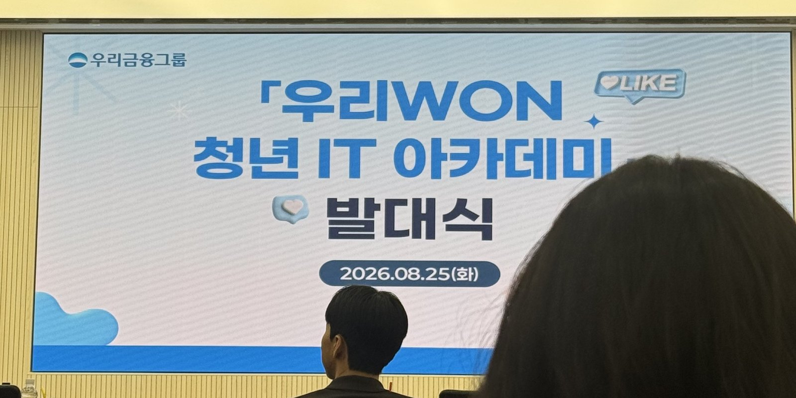
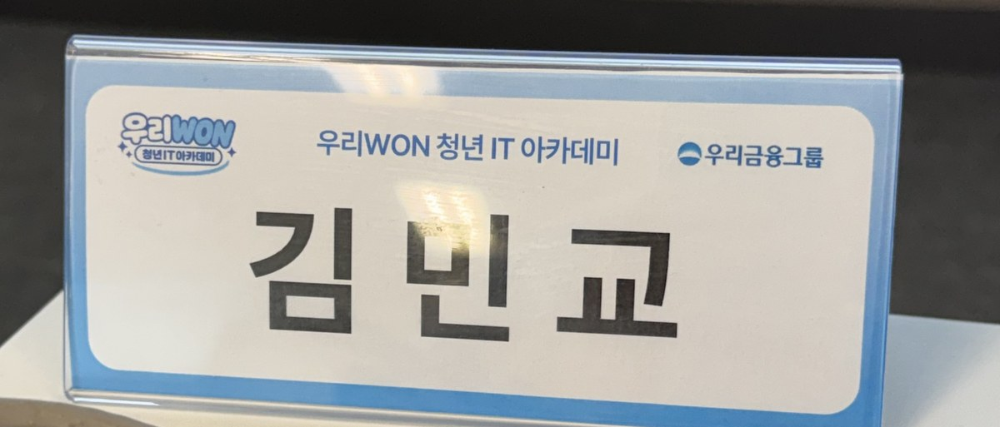

<p align="center">
  
</p>
<p align="center">
  <sub>2026.08.25 우리은행 본점에서 열린 발대식</sub>
</p>

<p align="center">
  
</p>

# 우리WON 청년 IT 아카데미 2026

> **고용노동부 주관 · 우리금융그룹 운영** K-뉴딜 아카데미<br>
> 금융IT 인재양성 과정(600시간) 학습 내용 정리 및 실습 기록

| | |
| --- | --- |
| **기간 · 시간** | 2026.08.25 ~ 12.11 · 평일 09:00~18:00 · **총 600시간** |
| **방식 · 장소** | **100% 오프라인** · 우리에프아이에스 아카데미 (상암IT타워) |
| **참여 계열사** | 우리금융지주 · 우리은행 · 우리카드 · 우리투자증권 · 동양생명 · ABL생명 · 우리에프아이에스 · 우리금융미래재단 |
| **기술 스택** | `Java` `Spring Boot` `React` `SQL` `Docker` `AWS` |
| **커리큘럼** | 프론트엔드 → DB → 백엔드 → 보안 → 클라우드 → **현업 주제 기반 프로젝트** |

**단원별 실습 주제가 처음부터 금융 도메인으로 지정돼 있다** — 멱등성 · 정합성 · 동시성 API,
컴플라이언스 대응, 무중단 배포. 여기에 **기업탐방**(우리은행 딜링룸 · 우리카드 발급실 ·
우리FIS 데이터센터), 현직자 멘토링, 금융AX 해커톤, 현업 데이터셋이 함께 제공된다.

→ [과정 전체 보기](./daily-log/0826.md)

---

## 🏦 프로젝트

| 프로젝트 | 설명 | 기술스택 | 기간 | 링크 |
| --- | --- | --- | --- | --- |
| **우리WON뱅킹 개발 프로젝트** | 현업 주제 기반 팀 프로젝트 — 기획 · 요구사항 분석 · 개발 · 테스트 · 배포 | _미정_ | 과정 후반 | _별도 저장소로 진행 후 링크_ |

## 📚 단원별 기록

| # | 단원 | 주요 내용 | 실습 |
| :---: | --- | --- | --- |
| 00 | [금융 IT 구조 이해](./00-finance-it) | 금융 시스템 구성, 데이터 흐름, IT 직무 | – |
| 01 | [금융 서비스 프론트엔드 개발](./01-frontend) | HTML·CSS, JavaScript, React | 우리WON뱅킹 핵심 UI 클론 코딩 |
| 02 | [금융 데이터베이스 설계 및 처리](./02-database) | SQL, 인덱스 · 쿼리 최적화 | 우리카드 소비데이터 패턴 분석 |
| 03 | [금융 시스템 서버 및 API 개발](./03-backend) | Java 객체지향, Spring Boot, REST API | 멱등성 · 정합성 · 동시성 API |
| 04 | [금융 보안](./04-security) | 인증 · 인가, 금융 보안 규정, 취약점 대응 | 컴플라이언스 고려 API |
| 05 | [금융 클라우드 인프라 및 배포](./05-cloud) | Linux · Docker, AWS, CI/CD, 모니터링 | 무중단 배포 및 모니터링 |
| 06 | [우리WON뱅킹 개발 프로젝트](./06-project) | 기획 · 요구사항 분석 · 개발 · 테스트 · 배포 | 현업 주제 기반 프로젝트 |

문법과 기본 개념은 각 단원 README에 정리했다.

---

## 🗓 Daily Log

### 2026.08

| 날짜 | Day | 다룬 내용 |
| --- | :---: | --- |
| [0825.md](./daily-log/0825.md) | 0 | 발대식(우리은행 본점) / 금융AX 인사이트 특강 — AI 생산성 단절과 조직 재구성 |
| [0826.md](./daily-log/0826.md) | 1 | 교육 개요 · 커리큘럼 / Git 3단계 영역 · 커밋 컨벤션 / Markdown |
| [0827.md](./daily-log/0827.md) | 2 | Git 되돌리기(`reflog` · `restore` · `revert`) / AI 코딩 도구 · 프롬프트 엔지니어링 · 버그 5종 디버깅 |
| [0828.md](./daily-log/0828.md) | 3 | 웹의 개념 · HTTP · 브라우저 구조 / HTML 시맨틱 태그 · 폼 · DOM / CSS 박스모델 · Flexbox · 반응형 |
| [0831.md](./daily-log/0831.md) | 4 | JavaScript 첫걸음 — 변수 · 데이터 타입 · 연산자 / 조건문 · 반복문 / 함수 |

### 2026.09

| 날짜 | Day | 다룬 내용 |
| --- | :---: | --- |
| [0901.md](./daily-log/0901.md) | 5 | 조건문 실습 · `bigInt` · 배열 / **금융IT 구조의 이해**(노광석 책임) · **카드 개발 프로세스**(김진수 대리) |
| [0902.md](./daily-log/0902.md) | 6 | 참조 자료형 — 배열 · Set · 객체 · Map · JSON / 반복문 · 함수 / **현직자 밋업** — 우리FIS 기업 소개 · IT영업 |
| [0903.md](./daily-log/0903.md) | 7 | 클래스 — `getter`/`setter` · `#private` · `static` · 상속 / DOM 과 이벤트 / **[타자 게임](https://mgyokim.github.io/woori-wonit-typing-game-mgyo/) 개선 후 배포** |

---

<details>
<summary><b>📁 디렉토리 구조 · ✍️ 기록 규칙</b></summary>

```
woori-wonit-2026/
├── README.md              # 전체 목차
├── assets/                # 이미지 리소스
├── daily-log/             # 날짜별 학습 기록 (MMDD.md)
├── 00-finance-it/         # 금융 IT 구조 이해
├── 01-frontend/           # 프론트엔드 (HTML·CSS·JS·React)
├── 02-database/           # 데이터베이스 (SQL·쿼리 최적화)
├── 03-backend/            # 서버 · API (Java·Spring Boot)
├── 04-security/           # 금융 보안 (인증·인가·취약점)
├── 05-cloud/              # 클라우드 · 배포 (Docker·AWS·CI/CD)
└── 06-project/            # 우리WON뱅킹 개발 프로젝트
```

- **Daily Log** : `daily-log/MMDD.md`, 첫 두 줄은 `# Day N — YYYY.MM.DD (요일)` + `> 학습 키워드`
- **Daily Log 구성** : `오늘의 핵심`(3가지 이내) → 직접 확인한 것 · 실습 → `회고`.
  **강의자료를 옮겨 적지 않는다** — 검색하면 나오는 내용 대신 *내가 걸린 것 · 판단한 것 · 틀렸던 것*을 남기고,
  원자료는 상단에 링크로만 건다. 나중의 나와 처음 보는 사람이 **핵심을 먼저** 읽을 수 있어야 한다.
- **README 핵심 표** : 그날 로그의 `오늘의 핵심` 중 하나를 골라 루트 README 표에 **한 줄로** 올린다.
  하루에 한 줄만 두고, 앞 날짜와 주제가 겹치지 않는 것으로 고른다.
- **Daily Log 표** : 날짜 오름차순 — 새로운 날짜는 표 맨 아래에 추가, 달이 바뀌면 `### YYYY.MM` 소제목 추가
- **회고** : Daily Log 마지막은 `## 회고` — Keep(유지할 것) · Problem(개선할 것) · Try(시도할 것) 각 1~2줄
- **단원 폴더** : 각 폴더의 `README.md`가 해당 단원의 목차 역할. **문법과 기본 개념은 여기까지만** 둔다
- **실습 기록** : 내세울 만한 실습은 단원 폴더에 STAR(Situation · Task · Action · Result)로 정리
- **커밋 컨벤션** : `feat` 기능 추가 / `fix` 버그 수정 / `doc` 문서 작성 · 수정 / `chore` 기타 설정

</details>
