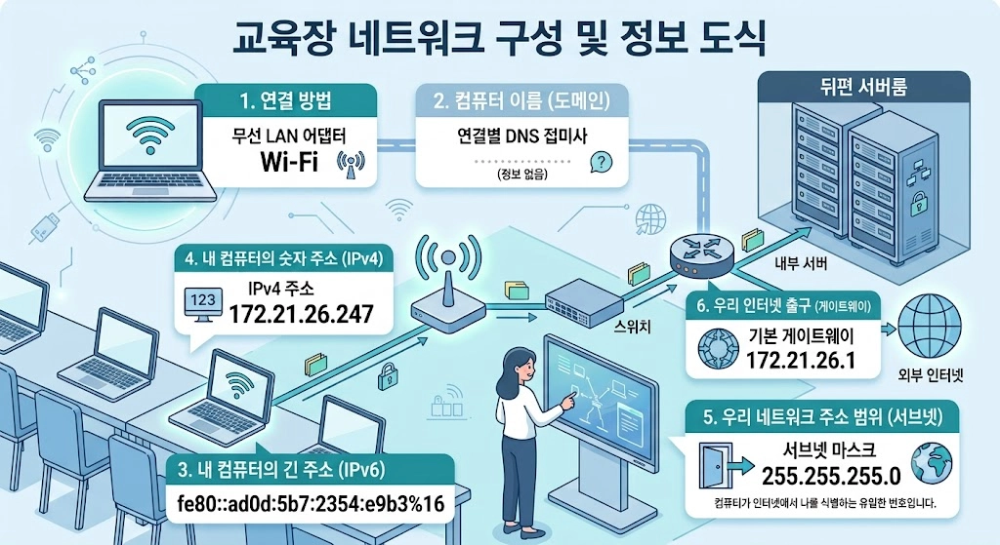
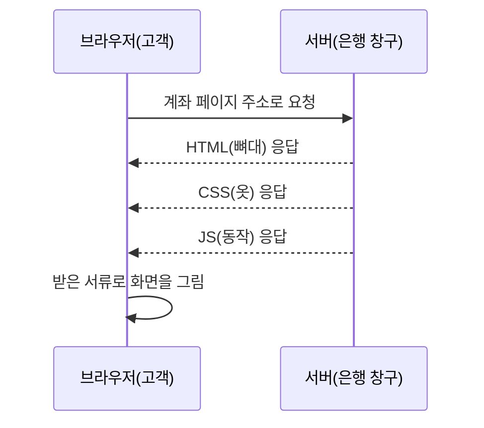

# Day 3 — 2026.08.28 (금)

> 웹 페이지의 뼈대와 옷 — HTML과 CSS

- 강의자료 : [Day 3 — HTML, CSS](https://paperdoll.notion.site/Day3-HTML-CSS-3c0efd733489818faa7dd29adfa6479e)
- 실습 저장소 : [WONIT-A/01_web](https://github.com/WONIT-A/01_web.git)
- 참고 : [User Inyerface — 최악의 UI 실험](https://userinyerface.com/) · [Designing delightful frontends (OpenAI)](https://developers.openai.com/blog/designing-delightful-frontends/)

> **오늘의 한 문장**
> 웹 페이지는 **뼈대(HTML)와 옷(CSS)** 으로 이루어진다.
> 뼈대는 "무엇이 있는가"를, 옷은 "어떻게 보이는가"를 담당한다.

## 학습 목표

- [x] HTML 태그로 화면의 구조를 짤 수 있다
- [x] 시맨틱 태그를 써야 하는 이유를 설명할 수 있다
- [x] 박스모델(여백 · 테두리 · 내용)을 그림으로 설명할 수 있다
- [ ] Flexbox로 요소를 가로로 나란히 배치할 수 있다 — _다음 시간_
- [ ] 계좌 카드 한 장을 HTML+CSS로 직접 완성할 수 있다

---

## 1. 웹의 개념과 기초

### 인터넷과 웹은 다르다

| | 정의 |
| --- | --- |
| **인터넷** | 컴퓨터끼리 연결되어 통신을 주고받는 **네트워크** |
| **웹(WWW)** | 그 인터넷 위에 정보가 얽혀 있는 **무형의 정보 네트워크**. 인터넷을 활용하는 응용 서비스 중 하나 |

**인터넷**은 웹의 개념이 나오기 전부터 있었다.

- 1969년 미 국방성 고등 연구 계획국(**ARPA**)
- **전쟁 시에도 군사 네트워크가 끊기지 않게 하기 위한 방안**으로 고안됨
- 컴퓨터마다 고유한 주소(IP 주소, 예: `113.198.80.208`)를 부여해 컴퓨터를 구분

**웹**은 웹 서버와 웹 브라우저(클라이언트)로 구성되는 정보 전달 · 공유 서비스다.

### WWW의 출발점

웹은 **팀 버너스리**가 유럽입자물리연구소(CERN)에 재직 중이던 **1989년 3월 12일**, 종이 한 장에 그린 개념도에서 출발했다.

> 곳곳의 컴퓨터에 저장돼 있는 정보를 인터넷을 통해 연결해 **언제, 어디서건 누구라도 접근할 수 있게** 하는 방법을 생각하다 웹 아이디어를 떠올렸다. **정보의 소유권은 소유자에게 그대로 둔 채 활용도만 극대화**하는 방법이었다.

웹 30주년 행사에서 버너스리는 *"누구나 자유롭게 콘텐츠를 만들고 접근할 수 있지만 데이터의 소유권은 각자에게 있다는 민주적인 이상에서 시작됐다"* 고 말했다.

- 최초의 웹사이트 : [info.cern.ch](http://info.cern.ch)
- HTML(Hyper Text Markup Language)을 기본으로 CSS, JS가 입혀진 형식으로 동작한다

### 웹의 세대

웹의 기본 목적은 **다른 사람 컴퓨터에 있는 문서를 공유하거나 보는 것**이다.

| 세대 | 특징 |
| --- | --- |
| 웹 1.0 | 문서 중심. 정적인 웹사이트 |
| 웹 2.0 | JavaScript 출현. 페이지가 동적으로 나오기 시작 |
| 웹 3.0 | **CGI**(Common Gateway Interface) 등장 — 웹 서버와 외부 프로그램 사이에 정보를 주고받는 방법 · 규약. 이 기술이 발전해 **지금의 백엔드**가 됨 |
| 웹 4.0 | **HTML5 표준**이 나오기 시작 |

**웹 4.0에서 달라진 것**

- 어도비 플래시 플레이어 대신, 이미지 · 동영상 · 음성을 HTML에서 **직접 연결**할 수 있게 됨
- `<audio>` `<video>` 태그로 웹에서 동영상 · 음성 데이터를 바로 보여줌
- 사용자 **접근성**을 중시하는 방향으로 HTML이 업그레이드됨
- JavaScript가 **표준 언어**로 지정됨

> 이 세대 구분은 강의 기준이다. 바깥에서 흔히 말하는 "웹 3.0(시맨틱 웹 · 블록체인)"과는 다른 구분이라, 검색할 때 헷갈리지 않도록 기억해 둘 것.

### 웹의 동작 방식

인터넷이 동작하려면 **최소 2대의 컴퓨터**가 필요하다.

| | 하는 일 |
| --- | --- |
| **웹 서버** | 웹 사이트를 탑재하는 컴퓨터 (google.com, naver.com 등) / 웹 문서 · 이미지 · 동영상 등의 데이터 저장 관리 / 클라이언트의 요청을 받아 웹 문서 전송 / 웹 서버로 작동하도록 하는 소프트웨어 실행 |
| **웹 클라이언트** | 사용자 인터페이스 담당 / 웹 서버에 웹 문서를 요청하고 받아 사용자에게 출력 |

**클라이언트가 서버에 접속하는 방법**

- **IP 주소** — `.` 사이 숫자 4단위, 각 0~255 사이의 숫자로 이루어진 서버 주소 (예: `142.251.42.196`)
- **도메인 주소** — IP 주소에 사람이 이해할 수 있는 문자 형식을 입힌 주소

```bash
$ ipconfig     # 맥에서 안 될 경우 ip addr
```



우리 교육장의 네트워크 구성 도식이다.

### 웹 표준

**웹 표준(Web Standard)** 은 '웹에서 사용되는 표준 기술이나 규칙'을 의미하며, **W3C의 권고안(REC)** 에서 나온 기술들이 여기에 해당한다.

이 표준 기술을 기준으로 브라우저(크롬 · IE · 사파리 등)가 만들어지는데, 만드는 업체마다

- 표준 기술을 **해석하는 차이**
- **새로운 기술 삽입** (표준화 제정 단계에 따른)

이 있어서 조금씩 다르게 구동되는 브라우저가 생긴다. **웹 표준을 지키는 이유가 곧 크로스브라우징**이다.

> ActiveX, Flash 같은 기술은 표준이 아니다. 지금은 거의 사라졌다.

### HTTP

**HTTP**(Hyper-Text Transfer Protocol) — HTML로 이루어진 **텍스트**를 네트워크를 통해 송 · 수신하는 방법.

- HTML로 이루어진 소스파일은 **서버에 존재**하고
- 브라우저는 서버로부터 HTML 소스파일을 **전송받아 화면에 표현**한다

### 브라우저의 구조

| 구성 요소 | 역할 |
| --- | --- |
| **User Interface** | 주소 표시줄, 이전/다음 버튼, 북마크 메뉴 — 페이지를 보여주는 창을 제외한 나머지 전부 |
| **Browser Engine** | User Interface와 Rendering Engine 사이의 동작을 제어 |
| **Rendering Engine** | 요청한 콘텐츠를 표시. HTML과 CSS를 **파싱**하여 화면에 그림 |
| **Networking** | HTTP 요청과 같은 네트워크 호출 |
| **JavaScript Interpreter** | JS 코드를 해석하고 실행. 크롬은 **V8** 엔진 |
| **Display Backend** | 기본 위젯(콤보 박스 등)을 그림 |
| **Data Persistence** | Local Storage, 쿠키 등 클라이언트 사이드 데이터 저장 |

---

## 2. 웹 페이지의 3요소

| 요소 | 역할 | 비유 |
| --- | --- | --- |
| **HTML** | 페이지에 제목 · 문단 · 표 · 이미지 · 동영상을 정의하고 그 **구조와 의미**를 부여하는 정적 언어 | 뼈대 |
| **CSS** | 마크업 언어가 실제 표시되는 방법(색상 · 크기 · 폰트 · 레이아웃)을 지정해 **콘텐츠 구조를 꾸며주는** 정적 언어 | 옷 |
| **JavaScript** | 콘텐츠를 바꾸고 움직이는 등 페이지를 **동적으로** 꾸며주는 프로그래밍 언어 | 근육 |

---

## 3. HTML

**HTML**(Hyper-Text Markup Language) — 하이퍼텍스트로 이루어진 소스코드. `<` `>` 로 이루어진 텍스트를 **마크업 언어**라고 한다.

- 언어로 볼지는 의견이 분분하다 (제어 · 분기문이 없음)
- 정확히 표현하면 **문서의 구조를 표현**한다
- 부족한 부분은 **JavaScript**가 대신한다

> 환경설정 — VS Code에 `open in browser`, `Live Server`, `Live Preview` 설치

### 3-1. HTML의 구조

**TAG**

- `<` `>` 를 이용해서 표현하며, 내용(contents)에 대한 **타입**을 나타낸다
- 태그는 **열리고 닫히는 한 쌍**이며, 이 구조가 태그의 **범위**를 만든다

```html
<opening tag> 내용 </closing tag>
<tagName />   <!-- self closing -->

<h1>HTML(Hyper-Text Markup Language)</h1>
<p>&lt;, &gt;로 이루어진 텍스트를 마크업 언어라고 합니다.</p>
```

**HTML 문서 작성 규칙**

- content 내의 **연속된 공백 또는 줄 바꿈은 하나의 공백**으로 처리된다
- 여러 개의 공백 · 탭 · 줄 바꿈은 **특수문자**로 표현한다
- 태그 이름은 대소문자를 구분하지 않으나 보통 **소문자**로 작성한다
- 각 태그의 **시작 태그와 종료 태그 쌍이 서로 교차되면 안 된다**

**부모와 자식 요소**

태그 A가 태그 B의 콘텐츠로 사용되면, B는 A의 **부모**, A는 B의 **자식**이다.

```html
<section class="fruits">
  <h1>과일 목록</h1>
  <ul>
    <li>사과</li>
    <li>딸기</li>
  </ul>
</section>

<!-- 이렇게 읽으면 된다 -->
<섹션영역 태그별명="fruits">
  <주제1>과일 목록</주제1>
  <순서없는목록>
    <항목>사과</항목>
  </순서없는목록>
</섹션영역>
```

가계도에서 할아버지 · 엄마 · 형제 같은 호칭을 정의하듯, HTML의 구조도 같은 개념으로 호칭을 정의한다. 이것이 **선택자(Selector)** 를 통해 CSS와 JS로 HTML을 다룰 때 중요하게 쓰인다.

**계층 구조**

- 최상위 태그는 항상 `<html>`
- `<head>` 와 `<body>` 는 `<html>` 의 하위 태그
- 계층은 일반적으로 **들여쓰기**로 표현

```html
<!DOCTYPE html>              <!-- HTML5 표준을 따르는 문서라는 표시 -->
<html lang="ko">             <!-- 문서 언어. 번역 여부와 스크린리더 발음의 기준 -->
<head>                       <!-- 화면에 보이지 않는, 문서의 정보 -->
    <meta charset="UTF-8"/>                        <!-- 문자 인코딩 방식 -->
    <meta name="author" content="Kim"/>            <!-- 저자 -->
    <meta name="description" content="..."/>       <!-- 문서 설명 -->
    <meta name="viewport" content="..."/>          <!-- 화면에 보여지는 영역 -->
    <meta name="keywords" content="..."/>          <!-- 검색 엔진 키워드 -->
    <meta http-equiv="refresh" content="3"/>       <!-- 지정된 HTTP 헤더 제공 -->
</head>
<body>
    <!-- 웹 브라우저에 보여지는 모든 내용 -->
</body>
</html>
```

> `charset` 이 없으면 브라우저가 인코딩을 추측해서 **한글이 깨진다.** `head` 최상단에 둘 것.

### 3-2. 기본 태그

**Heading** — 제목. `<h1>` ~ `<h6>` 6단계.

**Paragraph** — 문단 · 본문. `<p>`

- **Line Break** — HTML은 엔터도 태그로 표현한다. `<br>` (내용이 없어 닫지 않아도 됨)
- HTML은 줄바꿈 문자로 CRLF를 사용하지 않는다. 그래서 소스에서 엔터를 쳐도 화면에서 줄이 안 바뀐다
- **Non-breaking Space** — `&nbsp;` `&ensp;` `&emsp;`. 공백 대신 쓰는 공백문자

**리스트**

| 태그 | 뜻 |
| --- | --- |
| `<ol>` | 정렬된 리스트 (Ordered List) — 아이템 순서를 아라비아 숫자로 표현 |
| `<ul>` | 비정렬 리스트 (Unordered List) |
| `<dl>` `<dt>` `<dd>` | 정의 · 설명을 위한 리스트 (Description List) |

**테이블** — 일반 문서의 `표`에 해당.

```html
<table>
  <thead>              <!-- 제목 라인 -->
    <tr><th></th></tr> <!-- 행 / 컬럼 -->
  </thead>
  <tbody>              <!-- 표에 들어갈 내용 -->
    <tr><td></td></tr>
  </tbody>
</table>
```

> 예전엔 테이블로 레이아웃을 잡기도 했지만, **HTML5 표준부터는 데이터 문제로 `div`를 더 적극적으로 사용**한다.

**이미지** — `` 는 내용이 없는 태그.

```html

```

**anchor** — 하이퍼링크. 지금의 웹이 만들어지는 데 가장 중요한 기능.

```html
<a href="http://google.com" target="_blank">구글</a>
```

| `target` 값 | 이동 방식 |
| --- | --- |
| `_self` (기본) | 현재 창에서 이동 |
| `_blank` | 새 창에서 이동 |
| `_parent` | 현재 창보다 상위 창에서 이동 |
| `_top` | 최상위 창에서 이동 |

> **봇(bot)** 은 시드(seed) 페이지에서 출발해 하이퍼링크를 타고 다른 페이지를 찾아 전 세계 웹 페이지를 수집한다. 이렇게 모은 페이지에서 원하는 걸 가장 빠르게 찾아준 것이 구글이다.

**비슷해 보이지만 다른 태그**

| 시각적 표현만 | 의미까지 (시맨틱) |
| --- | --- |
| `<i>` — 이탤릭 | `<em>` — 강조 |
| `<b>` — 굵게 | `<strong>` — 중요함 |

### 3-3. 속성(Attribute)과 값(Value)

태그의 기능을 확장하기 위해 속성을 쓴다.

```html
<TAG 속성="값"></TAG>

<a href="http://google.com">Hello!!</a>
<div class="name">HTML</div>
```

- 시작 태그에 `속성이름="값"` 형태로 쓴다
- 속성 이름은 대소문자를 구분하지 않지만 **소문자 권장**
- `<div>` 는 **의미를 가지지 않는** 태그로 범위를 묶는(Wrap) 용도다. 그 내용이 무엇인지 알 수 없으므로 `class` 같은 별명을 붙인다

| 구분 | 설명 |
| --- | --- |
| **일반 속성** | 태그별로 사용할 수 있는 속성이 정해져 있다. 전부 외우는 건 불가능하니 그때그때 찾아본다 |
| **글로벌 속성** | 모든 태그에서 공통으로 쓸 수 있다 — `class`, `id`, 이벤트 속성, 스타일 속성 |
| **Character Entity** | `&nbsp;` `&lt;` `&gt;` 처럼 특수문자를 표현하는 단위 |

### 3-4. 입력 태그

사용자로부터 입력을 받아 **서버에 전달**하기 위한 용도.

**form**

```html
<form action='url/app/id' method='post'>
  <!-- 여러 입력 태그 -->
</form>
```

| 속성 | 설명 |
| --- | --- |
| `action` | 입력 데이터를 처리할 서버(백엔드)의 URL |
| `method` | 데이터를 전달하는 방법 (GET / POST) |

| 방식 | 특징 |
| --- | --- |
| **GET** | URL/URI를 통해 전달. 데이터가 **쉽게 외부에 노출**되어 보안에 취약. 중요하지 않은 데이터에 사용 |
| **POST** | 별도의 방식으로 전달. 쉽게 노출되지 않음. **https**를 쓰면 암호화되어 더욱 확인이 어렵다 |

**input 타입**

| 타입 | 용도 |
| --- | --- |
| `text` / `password` | 텍스트 / 비밀번호 |
| `radio` | 여러 항목 중 **하나** 선택 — `name` 으로 묶는다 |
| `checkbox` | 여러 항목 중 **여러 개** 선택 |
| `date` / `month` / `week` / `time` / `datetime-local` | 날짜 · 시간 |
| `color` / `number` / `range` | 색상 / 숫자 / 범위 |
| `email` / `url` / `tel` | 형식 자동 체크 |
| `file` | 파일 선택 |
| `button` / `submit` / `reset` | 버튼 / 전송 / 초기화 |
| `hidden` | 화면에 안 보이는 값 |

**주요 공통 속성** — `readonly` (읽기 전용) · `disabled` (비활성화) · `autocomplete` (자동 완성) · `autofocus` (로드 시 포커싱) · `placeholder` (희미한 설명) · `required` (필수) · `spellcheck` (오타 점검)

- `name` 은 각 입력 요소를 구분하는 **중요한 속성**이다. 데이터를 서버에 전달할 때 **변수의 이름**으로 쓰이므로 반드시 정의한다
- `value` 에는 실제로 백엔드/JS에서 쓸 값을 적는다. **영어로, 띄어쓰기 없이**

**select · textarea · label**

```html
<select id="food" name="food" multiple>
  <optgroup label="음식">
    <option value="pizza" selected>피자</option>
    <option value="hamburger">햄버거</option>
  </optgroup>
  <optgroup label="후식">
    <option value="cola">콜라</option>
  </optgroup>
</select>

<textarea name="article" rows="20" cols="30">텍스트</textarea>

<label for="name">이름:</label>
<input type="text" id="name" name="name">
```

> `<label>` 은 **클릭의 유효 범위**를 넓혀준다. 글자를 눌러도 입력칸이 선택된다.

`<fieldset>` 과 `<legend>` 로 폼을 묶으면 회원가입 폼처럼 영역이 구분된다.

**전송되는 값의 규칙 세 가지** (직접 `method` 를 바꿔가며 확인)

- 한글이 `%EA%B9%80` 처럼 바뀐다 → **URL 인코딩**
- 체크박스 여러 개는 `avail_language=HTML&avail_language=CSS` 처럼 **같은 이름이 반복**된다
- **체크 안 한 라디오 · 체크박스는 아예 안 들어간다** (빈 텍스트 칸은 `sex=` 처럼 들어간다)
- 쿼리스트링 — `?` 뒤에 `키=값&키=값` (`?name=김민교&affiliation=FIS-WONIT`)

**값을 꺼내는 방법이 종류마다 다르다**

| 종류 | 꺼내는 법 |
| --- | --- |
| text, date, color, range, tel | `.value` |
| 체크박스 하나 | `.checked` (true / false) |
| 라디오 묶음 | `.value` — 선택된 것의 값 |
| 체크박스 묶음 | 반복문으로 `.checked` 인 것만 모은다 |
| multiple select | `.selectedOptions` |

> 같은 `name` 이 **하나뿐이면 목록이 아니라 요소 하나**가 온다. 이 예외 처리가 빠지면 체크박스를 하나로 줄였을 때 코드가 깨진다.

### 3-5. 오디오 · 비디오

```html
<audio src="audio.mp3" controls autoplay></audio>
<video src="video.mp4" controls width="500" height="400" poster="thumb.jpg"></video>
```

`src` (경로) · `controls` (재생 제어기) · `autoplay` · `loop` · `muted` · `preload` · `poster` (비디오 썸네일)

### 3-6. 레이아웃

배치하는 방법은 세 가지다 — `div`, **시맨틱 태그**, `table`(HTML5 표준부터 사용하지 않음).

**iframe** — inline frame. 웹 페이지 안에 또 다른 웹 페이지를 표현한다.

```html
<iframe src='https://www.daum.net'></iframe>
```

> 🚩 네이버 메인에서 콘솔에 `document.head.parentNode.removeChild(document.head);` 를 입력하면 CSS가 사라진다. 그런데도 일부 영역이 여전히 "옷을 입고 있는" 이유는 **iframe으로 만들어져 있어서**다.

**시맨틱 태그** — HTML5 표준에서 레이아웃을 위해 새로 제공하는 태그들.

`header` · `nav` · `main` · `section` · `article` · `aside` · `footer`

```html
<!-- HTML5 이전 -->
<div id="header" role="banner">
<div id="container" role="main">

<!-- HTML5 이후 -->
<header id="daumHead" class="head_daum">
<main id="daumContent">
```

> **시맨틱 태그를 써도 배치가 자동으로 되지는 않는다.** 검색 용이성 · 웹 접근성 · 유지보수를 위해 **의미적으로** 사용하는 것이고, **배치는 CSS로** 해야 한다.

---

## 4. 웹 화면의 동작 방식 — DOM

### 브라우저가 화면을 그리기까지



브라우저가 주소를 입력해 서버에 서류를 요청하는 것은 **은행 창구에서 서류를 요청하고 받아오는 것**과 같다.

### HTML은 건물의 뼈대다

집을 지을 때 가장 먼저 하는 일은 인테리어가 아니라 **골조 공사**다. 어디가 거실이고 어디가 방인지부터 정해야 벽지를 바르고 가구를 놓을 수 있다.

| 건축 용어 | HTML로 치면 |
| --- | --- |
| 골조 (뼈대) | HTML 문서 전체 |
| 방 하나하나 | 태그 하나하나 (`<div>`, `<p>`) |
| 방문에 붙은 이름표 | 시맨틱 태그 (`<header>`, `<nav>`) |
| 이름표 없는 창고 | 의미 없는 `<div>` |

> **시맨틱 태그가 왜 필요한가** — "이름표 없는 창고"만 있는 집은 주인만 어디가 뭔지 안다. 화면 낭독기나 검색엔진은 `<div>` 만 보고는 그게 메뉴인지 본문인지 알 수 없다. `<nav>`, `<header>` 라고 이름을 붙여줘야 **기계도 사람도** 구조를 이해한다.

### DOM (Document Object Model)

- XML과 HTML 문서를 **동적으로 변경 가능**하게 하는 기술
- 모든 프로그래밍 언어가 DOM 기술을 적용한다 — Java는 주로 XML 문서, JavaScript는 브라우저의 HTML 문서
- **브라우저가 HTML 문서를 이해하는 과정**
  - 모든 태그와 텍스트를 **상속 관계의 개별 객체**로 간주
  - 속성을 제외한 태그와 텍스트 데이터를 각각 **트리 구조**로 간주
  - tag(element) / text / attribute 를 **개별 객체**로 보는 구조

직접 복잡한 DOM 조작을 쓰기보다, AI에게 **"id가 chat-box인 곳에 채팅 메시지를 추가하는 함수를 짜줘"** 라고 요구하는 편이 낫다.

---

## 5. CSS

### CSS는 인테리어다

뼈대만 있는 집에는 사람이 살 수 없다. 벽지를 바르고 가구를 배치해야 비로소 공간이 된다. **같은 골조라도 인테리어에 따라 전혀 다른 집이 되듯, 같은 HTML도 CSS에 따라 전혀 다른 화면이 된다.**

| 인테리어 개념 | CSS로 치면 |
| --- | --- |
| 액자 (그림 + 여백 + 테두리 + 액자와 벽 사이 거리) | **박스모델** (content + padding + border + margin) |
| 서랍장에 물건을 나란히 정리 | **Flexbox** 레이아웃 |
| 벽지 색, 조명 | `color`, `background` |

### 박스모델

모든 HTML 요소는 액자처럼 **4겹**으로 되어 있다. 안쪽부터

**content(내용) → padding(안쪽 여백) → border(테두리) → margin(바깥 여백)**

- 카드에 여백이 좁아 답답해 보이면 → `padding`
- 카드끼리 너무 붙어 있으면 → `margin`

### 모바일 대응 — viewport

은행 앱은 대부분 스마트폰으로 쓴다. 그런데 HTML에 아무 설정이 없으면 모바일 브라우저는 **PC 화면 기준(보통 980px)** 으로 페이지를 그린 뒤 축소해서 보여준다. 글씨가 깨알같이 작아져 확대해야만 읽을 수 있다.

```html
<meta name="viewport" content="width=device-width, initial-scale=1">
```

"이 화면은 **기기 너비에 맞추고, 처음 배율은 100%** 로 보여줘"라고 브라우저에 알려주는 한 줄이다.

> 오늘 실습은 **375px(일반적인 스마트폰 화면 너비) 기준**이다. 이 meta 태그가 없으면 375px로 만든 화면도 PC처럼 축소되어 나타난다.

### 자주 쓰는 속성

| 속성 | 역할 |
| --- | --- |
| `color` / `background` | 글자색 / 배경색 |
| `padding` / `margin` | 안쪽 여백 / 바깥 여백 |
| `border` / `border-radius` | 테두리 / 모서리 둥글기 |
| `font-size` / `font-weight` | 글자 크기 / 굵기 |
| `display: flex` | 자식 요소를 가로(또는 세로)로 나란히 배치 |
| `justify-content` / `gap` | 정렬 방향 / 요소 사이 간격 |

### 반응형 웹

과거에는 화면 너비를 노트북 기준으로 고정하고, 큰 화면에서는 내용을 중앙에 두고 양쪽에 여백을 줬다. 그러다 PC보다 모바일 접속이 빈번해지면서 **모바일 사이트를 별도 제작**하기 시작했다. 이게 너무 귀찮아서, 똑똑하게 게으른 개발자들이 **하나의 문서로 다양한 화면 크기에 대응하는** 방법을 찾기 시작했다.

**반응형 웹(responsive web)** — 브라우저 크기에 실시간으로 반응하여 레이아웃이 변하는 웹 사이트.

- W3C 웹 표준이므로 **모든 스마트기기에서 접속 가능**
- 가로모드 가능
- **사이트가 하나라서 유지 · 관리가 용이**

> 개발자도구(`F12`) → **디바이스 모드** 버튼으로 확인할 수 있다.

### CSS 미디어 쿼리

**특정 조건을 만족할 때만 코드를 동작시키는 기능.** 반응형 웹 디자인의 핵심이다.

```css
@media 유형 (조건) {   /* 유형은 생략 가능 */
    /* 변경할 선언 */
}
```

**미디어 유형** — `all` · `print` · `screen` · `speech` (생략하면 모든 유형에 적용)

```css
@media screen and (max-width: 400px) {   /* min- / max- 접두사로 최소·최대 지정 */
    body { color: blue; }
}

@media (orientation: landscape) {        /* 세로(portrait) / 가로(landscape) */
    body { color: blue; }
}

@media (hover: hover) {                  /* 포인팅 장치 사용 가능 여부 */
    body { color: blue; }
}

@media print {                           /* 인쇄될 때만 */
    body { font-size: 20pt; }
}
```

### 웹 폰트 사이즈 단위 5가지

| 단위 | 기준 |
| --- | --- |
| `px` | **고정**. 창 크기와 무관하게 동일한 사이즈 유지 |
| `em` | 앞서 적용된(부모) 폰트 크기의 **배수** — 상속됨 |
| `rem` | 웹 브라우저 **기본 크기(16px)** 의 배수. `3rem = 48px` |
| `vw` | 뷰포트 **가로**의 1/100. 너비 변화에 따라 변함 |
| `vh` | 뷰포트 **세로**의 1/100. 높이 변화에 따라 변함 |

### Positioning

| 값 | 동작 |
| --- | --- |
| `static` (기본) | 블록과 인라인에 따라 자동 결정. **기본 흐름에 따른 배치** |
| `relative` | `top`/`bottom`/`left`/`right` 로 **원래 자기 자신의 위치**에서 변경 |
| `absolute` | **자기를 감싸는 태그**에 대해 상대적으로 위치 지정. 상위 태그가 `static` 이면 해당하지 않고 `body` 기준이 된다 |
| `fixed` | **고정 위치**. 스크롤해도 항상 같은 영역에 표시 |
| `sticky` | `static` + 자기 자리를 지나치면 `fixed` |

> `top`/`left`/`z-index` 는 `position` 이 `static` 이면 **무시된다.** AI 코딩 실습에서 모달이 안 보였던 원인이 정확히 이것이었다.

### z-index

- `position` 을 쓰면 요소를 **겹치게** 놓을 수 있다
- 이때 **수직(앞뒤) 위치**를 `z-index` 로 정한다
- 값은 정수. **숫자가 클수록 위로**, 작을수록 아래로

### Flex & Grid

> **아직 진도가 나가지 않은 부분이다.** 강의자료에는 포함되어 있어 미리 정리해 두고,
> 실습은 다음 시간에 한다. 실습 ②(계좌 카드에 CSS 입히기)도 여기까지 배운 뒤에 완성한다.

| | 차원 |
| --- | --- |
| **Flex** | **한 방향** 레이아웃 (1차원 — 중심축, 반대축) |
| **Grid** | **두 방향**(가로-세로) 레이아웃 (2차원) |

둘 다 부모(`container`)와 자식(`items`)으로 제어한다.

`display: flex` 를 부모 상자에 걸면, 그 안의 자식들이 **서랍 속 물건처럼 한 줄로** 정렬된다.

```css
#container {
    display: flex;
    flex-direction: row;          /* row-reverse 로 뒤집기 */
    flex-wrap: wrap;              /* 넘치면 줄바꿈 */
    flex-grow: 1;                 /* 남는 공간을 나눠 가짐 */
    flex-shrink: 1;               /* 부족하면 줄어듦 */
    flex-basis: 30%;              /* 기본 크기 */
    justify-content: space-between;  /* 양 끝으로 밀어 배치 */
    align-items: center;             /* 세로 가운데 정렬 */
    gap: 8px;                        /* 요소 사이 간격 */
}
```

> 연습 : [Flexbox Froggy](https://flexboxfroggy.com/) — 개구리가 가라앉지 않게 도와주세요

---

## 6. 실습

### 실습 ① AI에게 구조만 시켜보기

아직 CSS를 배우기 전 단계라 **구조만** 요청했다.

```
너는 금융권 프론트엔드 개발자다.
은행 앱의 "계좌 카드" 화면 구조를 HTML만으로 만들어 줘.

[표시 내용]
- 은행명 (제목) / 계좌번호 (마스킹된 텍스트) / 잔액
- 버튼 두 개: "이체", "상세"

[제약]
- CSS는 쓰지 말고 HTML 구조만.
- 시맨틱 태그를 쓸 수 있는 곳은 시맨틱 태그로.
- 각 태그 옆에 왜 이 태그를 골랐는지 한 줄 주석.
```

결과를 받은 뒤 반드시 되물을 것 — **"여기서 `<div>` 대신 시맨틱 태그를 쓸 수 있는 곳이 있어?"**

이 되물음에서 `<div>` 로 감싸져 있던 곳이 `<article>` `<dl>` `<footer>` 로 바뀌었다.

**태그를 고른 근거**

| 태그 | 이유 |
| --- | --- |
| `<article>` | 카드 한 장이 **그 자체로 완결된** 독립 콘텐츠라서. 다른 화면에 옮겨도 말이 된다 |
| `<header>` | 카드의 머리말. "어느 은행 계좌인지" 식별하는 정보를 묶는 자리 |
| `<h2>` | 페이지 제목(`h1`) **아래 계층**이므로 `h1`이 아니다 |
| `<dl>` `<dt>` `<dd>` | "이름 - 값" 쌍이 반복되는 구조. `table`은 행과 열이 있는 **2차원** 데이터용 |
| `<data value="1523000">` | 사람이 읽는 `"1,523,000원"` 과 기계가 읽는 **원 단위 정수**를 같이 담는다 |
| `<footer>` | 본문에 딸린 보조 영역. 카드에 대한 행동 버튼을 모은다 |
| `<button type="button">` | **동작**을 일으키므로 `a`가 아니다. `type`을 생략하면 `form` 안에서 **submit으로 동작해 폼이 전송되는 사고**가 난다 |

### 실습 ② AI에게 스타일 시키기 (다음 시간)

```
너는 금융권 프론트엔드 개발자다.
아래 HTML 계좌 카드에 CSS를 입혀줘.

[디자인 요구사항]
- 카드는 흰 배경, 옅은 그림자, 모서리는 둥글게
- 은행명은 굵게, 잔액은 크게
- "이체" "상세" 버튼은 Flexbox로 카드 하단에 나란히, 양 끝 정렬

[제약]
- CSS 파일 하나로만 작성. 외부 라이브러리 금지.
- 속성마다 한글 주석으로 "왜 이 속성을 썼는지" 설명.
```

받은 CSS에서 `padding`, `margin`, `display: flex` 가 어디에 쓰였는지 찾아 표시해 볼 것.

**완성 기준** — 그림자 · 둥근 모서리가 있고, 버튼 두 개가 Flexbox로 나란히 정렬되어 있을 것.

### 실습 ③ 나의 포트폴리오 페이지 (완료)

과제 안내는 `01_web/99_mission` 폴더 기준이지만, 제출이 **별도 remote repository** 단위라
처음부터 독립 저장소로 만들어 GitHub에 올렸다.

- `index.html` — 1일차에 만든 GitHub 자기소개 마크다운을 넘겨 HTML로 변환 요청
- `keyword.html` — 나를 설명하는 키워드 3가지를 각각 박스 컨테이너로
  - 즐겨보는 콘텐츠 / 취미 / 외출할 때 가방에 꼭 챙기는 물품

**완성 기준**

- 시맨틱 태그로 `header` / `main` / `footer` 완성
- `header` 에 두 페이지를 오가는 **navigation bar**
- 의미 없는 `<div>` 를 최소한으로, 쓸 수 있는 곳엔 시맨틱 태그로 **웹 접근성 준수**

**제출** — `99_mission` 폴더를 최상위로 하여 `portfolio` 라는 remote repository를 만들어 HTML · CSS 파일을 올리고 커밋 링크 공유.

### 프론트엔드 프롬프팅 팁

| | 방법 | 방지 효과 |
| --- | --- | --- |
| **A** | **프레임워크 명시** — "MUI 최신버전, CDN 포함 단일 HTML 파일로" | 구버전 코드, 알 수 없는 CSS, React/Vue 코드 지양 |
| **B** | **구조와 디자인 묘사** — "상단에 파란 배경 네비게이션 바(로고 + 로그인 버튼), 중앙에 Card 형태 폼" | 원하는 레이아웃과 동떨어진 결과물 방지 |
| **C** | **class 우선, 커스텀 CSS 최소화** — "기본 utility 클래스를 쓰고 `<style>` 안의 커스텀 CSS는 최소화" | 코드가 길어져 나중에 수정하기 어려워지는 현상 방지 |

**나쁜 예** — "채팅 화면 만들어줘" → AI가 임의의 프레임워크나 복잡한 CSS로 코드를 던진다. 유지보수 불가.

---

## 7. 오늘 배운 것 확인

**Q1. `<div>` 와 `<header>` 의 차이는?**

기능은 둘 다 "묶는 상자"로 같지만, `<header>` 는 **"이건 상단 영역이다"라는 의미**를 담고 있다. 검색엔진과 화면 낭독기가 구조를 이해하는 데 이 의미가 필요하다.

**Q2. 카드 안쪽 여백이 좁을 때 고쳐야 할 속성은?**

`padding`. `margin` 은 카드와 카드 **바깥** 간격을, `padding` 은 카드 **안쪽** 여백을 조절한다.

**Q3. 버튼 두 개를 가로로 나란히 놓고 싶을 때 부모 상자에 걸어야 하는 속성은?**

`display: flex`. 이후 `justify-content` 로 정렬 방향을, `gap` 으로 간격을 조절한다.

---

## 📎 오늘의 산출물

- [x] 계좌 카드 HTML 파일 (시맨틱 태그 사용)
- [ ] 계좌 카드 CSS 파일 (박스모델 + Flexbox 적용) — Flexbox 진도 이후
- [x] `01_web/` 폴더에 커밋 (접두사 포함)
- [x] 포트폴리오 파일 — 별도 저장소로 분리해 GitHub에 게시
- [x] AI 프롬프트 결과와 내가 고친 부분을 `daily-log/0828.md` 에 기록

---

## 회고

**Keep** — 태그마다 "왜 이걸 골랐는지" 주석을 한 줄씩 남긴 것. `button` 의 `type` 을 생략하면 폼이
전송된다는 건 주석을 쓰려고 근거를 찾다가 알게 됐다. 설명을 적으려면 먼저 이해해야 한다.

**Problem** — AI가 준 첫 구조는 대부분 `<div>` 였다. 그대로 받았으면 "동작은 하지만 의미가 없는"
HTML이 남았을 것이다. 되물었을 때야 시맨틱 태그로 바뀌었는데, **되물을 줄 몰랐으면 몰랐을 문제**다.

**Try** — 요청할 때 제약(프레임워크 · 단일 파일 · 커스텀 CSS 최소화)을 처음부터 적어 본다.
오늘은 결과를 받고 고치는 쪽이었는데, 제약을 먼저 주는 편이 왕복이 적을 것 같다.

> `position: static` 이면 `top` 과 `z-index` 가 무시된다는 것을 오늘 CSS 시간에 배웠는데,
> 어제 AI 코딩 실습에서 모달이 화면에 안 보였던 원인이 정확히 그것이었다.
> **어제는 증상으로 겪고 오늘은 규칙으로 배운 셈이다.** 규칙을 알고 나니 그때 왜 콘솔에
> 에러가 안 떴는지도 설명이 된다 — 문법이 틀린 게 아니라 조건이 안 맞아 무시된 것이었다.
